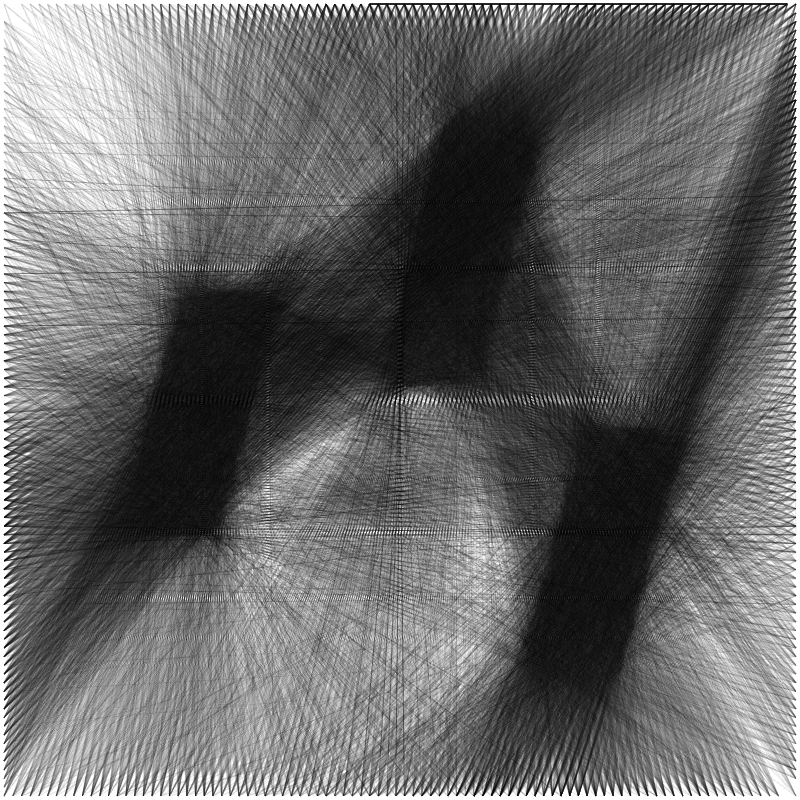

# UDITA

**Universal Device Interface for Test Automation**

UDITA is a multi-device iOS automation system that enables remote control of multiple iPhones from a Mac via WebDriverAgent (WDA). It provides a web-based dashboard for controlling iOS devices over Wi-Fi, with automatic device discovery and session management.



## Features

- **Multi-device support:** Control multiple iPhones simultaneously from a single dashboard
- **Web-based interface:** Browser-based control panel at `http://localhost:5050`
- **Automatic device discovery:** Network scanning to detect available iOS devices
- **Session management:** Auto-refresh sessions with device switching capability
- **WebDriver automation:** Full WDA integration for iOS automation
- **Zero configuration:** Automatic code signing and Xcode setup

## Architecture

UDITA consists of three main components:

1. **`udita`** - Main launcher script that handles setup, code signing, and orchestration
2. **`bridge/`** - Mac-side Python Flask server that manages device connections and provides the web dashboard
3. **`wda/`** - WebDriverAgent iOS app that runs on each iPhone to enable remote control

## Quick Start

### Prerequisites

- macOS with Xcode installed
- One or more iPhones on the same Wi-Fi network as your Mac
- Apple Developer account (free or paid)

### Installation & Setup

1. **Clone the repository:**
   ```bash
   git clone <repository-url>
   cd UDITA
   ```

2. **Run UDITA:**
   ```bash
   ./udita
   ```

   The script will automatically:
   - Detect your Apple Developer Team ID
   - Configure code signing for WebDriverAgent
   - Build and deploy WDA to connected devices
   - Start the bridge server

3. **Open the dashboard:**
   - Navigate to `http://localhost:5050` in your browser
   - Select a device from the dropdown
   - Start controlling your iPhone!

### Manual Device Configuration (Optional)

If you want to specify device IPs manually:

```bash
export DEVICES=192.168.0.107,192.168.0.108
./udita
```

Or use the bridge directly:

```bash
cd bridge
export DEVICES=192.168.0.107,192.168.0.108
./start.sh
```

### Bridge-Specific Quick Start

If you prefer to run just the bridge server (assuming WDA is already running on devices):

1. Start WDA on each iPhone (see `wda/BUILD_INSTRUCTIONS.md`). Ensure same Wi-Fi as Mac.
2. Run the bridge:
   ```bash
   cd bridge
   ./start.sh
   ```
   Optional: `export DEVICES=192.168.0.107,192.168.0.108` before running
3. Open `http://localhost:5050` — select device from dropdown, then use the dashboard.

**Note:** Session auto-refreshes; if a device goes offline, pick another from the dropdown or retry.

## Project Structure

```
UDITA/
├── udita              # Main launcher script (automatic setup & code signing)
├── bridge/            # Mac-side server
│   ├── server.py      # Flask server for device management
│   ├── start.sh       # Bridge startup script
│   └── README.md      # Bridge-specific documentation
├── wda/               # WebDriverAgent for iOS
│   ├── WebDriverAgent.xcodeproj
│   └── README.md      # WDA documentation
├── logo.png           # Project logo
└── LICENSE            # MIT License
```

## How It Works

1. **WebDriverAgent (WDA)** runs on each iPhone, exposing a WebDriver HTTP server on port 8100
   - One WDA app per iPhone (build from `wda/`, run on each device)
   - Must be on the same Wi-Fi network as your Mac
   
2. **Bridge server** runs on your Mac, providing:
   - Device discovery and connection management
   - WebDriver API proxy to forward commands to devices
   - Web dashboard for device control
   - Session management and auto-refresh
   - Multi-device support via dropdown selector
   
3. **Dashboard** provides a browser-based interface to:
   - Select active device from dropdown (list from env `DEVICES` or add via "Set" button)
   - View device screen
   - Send touch events and gestures
   - Execute automation commands
   - If a device goes offline, simply pick another from the dropdown or retry

## Configuration

Environment variables (optional):

- `DEVICES` - Comma-separated list of device IPs (e.g., `192.168.0.107,192.168.0.108`)
- `WDA_PORT` - WebDriverAgent port (default: `8100`)
- `SCREEN_WIDTH` - Device screen width (default: `393`)
- `SCREEN_HEIGHT` - Device screen height (default: `852`)

## Troubleshooting

### Device Not Appearing

- Ensure iPhone and Mac are on the same Wi-Fi network
- Check that WDA is running on the device (you should see "ServerURLHere" on screen)
- Verify the device IP is correct

### Code Signing Issues

The `udita` script automatically handles code signing, but if you encounter issues:

1. Open Xcode and add your Apple ID in Preferences → Accounts
2. Run `./udita` again - it will auto-detect your Team ID
3. For manual setup, see `wda/BUILD_INSTRUCTIONS.md`

### Session Expired

If a device goes offline or the session expires:
- Select another device from the dropdown, or
- Refresh the page to reconnect

## Development

### Running Bridge Standalone

```bash
cd bridge
python3 server.py --ip 192.168.0.107
```

### Building WDA Manually

See `wda/README.md` and `wda/BUILD_INSTRUCTIONS.md` for detailed instructions.

## License

MIT License - see [LICENSE](LICENSE) file for details.

Copyright (c) 2025 photon-hq

## Credits

- Built on [WebDriverAgent](https://github.com/appium/WebDriverAgent) by Appium
- Uses Flask for the bridge server
- Inspired by the need for simple multi-device iOS automation

---

**Have fun automating!** 🚀
